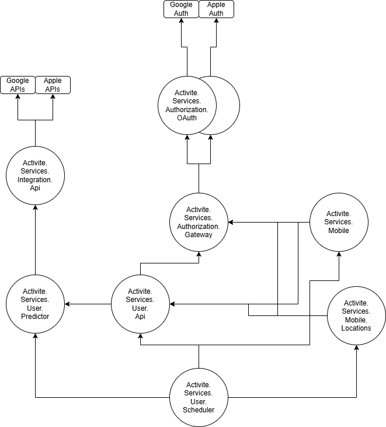

# Activite.Services

All services required for **Activite**

### Sub Modules

| Name      | Explanation                                             |
|--------------|------------------------------------------------------|
| **Activite.Services.Index** | https://activite.tech/ |
| **Activite.Services.Infra** | docker-compose |

### Micro Services

| Name      | Status                                                  |
|--------------|------------------------------------------------------|
| **Activite.Services.Authorization.Gateway** | Not Started |
| **Activite.Services.Authorization.OAuth** | Not Started |
| **Activite.Services.Integration.Api** | Not Started |
| **Activite.Services.Mobile** | Not Started |
| **Activite.Services.Mobile.Locations** | Not Started |
| **Activite.Services.User.Api** | Not Started |
| **Activite.Services.User.Predictor** | Not Started |
| **Activite.Services.User.Scheduler** | Not Started |

#### Diagram
