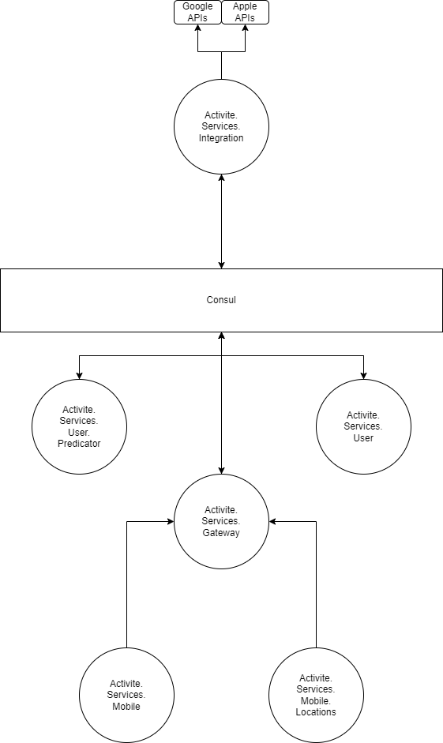

# Activite.Services

All services required for **Activite**

### Sub Modules

| Name      | Explanation                                             |
|--------------|------------------------------------------------------|
| **Activite.Services.Authorization.Gateway** | Routes authorization requests |
| **Activite.Services.Authorization.OAuth** | OAuth authorization module, can run multiple instances for different OAuth integrations |
| **Activite.Services.Index** | https://activite.tech/ |
| **Activite.Services.Infra** | docker-compose |
| **Activite.Services.Integration.Api** | get user data |
| **Activite.Services.Mobile** | mobile app for customers |
| **Activite.Services.Mobile.Locations** | mobile app for businesses |
| **Activite.Services.User.Api** | main DB service |
| **Activite.Services.User.Predictor** | personalized feed and recommendations |
| **Activite.Services.User.Scheduler** | scheduled marketing |

### Micro Services

| Name      | Status                                                  |
|--------------|------------------------------------------------------|
| **Activite.Services.Authorization.Gateway** | Opened Repository |
| **Activite.Services.Authorization.OAuth** | Opened Repository |
| **Activite.Services.Integration.Api** | Opened Repository |
| **Activite.Services.Mobile** | Opened Repository |
| **Activite.Services.Mobile.Locations** | Opened Repository |
| **Activite.Services.User.Api** | Opened Repository |
| **Activite.Services.User.Predictor** | Opened Repository |
| **Activite.Services.User.Scheduler** | Opened Repository |

#### Diagram
